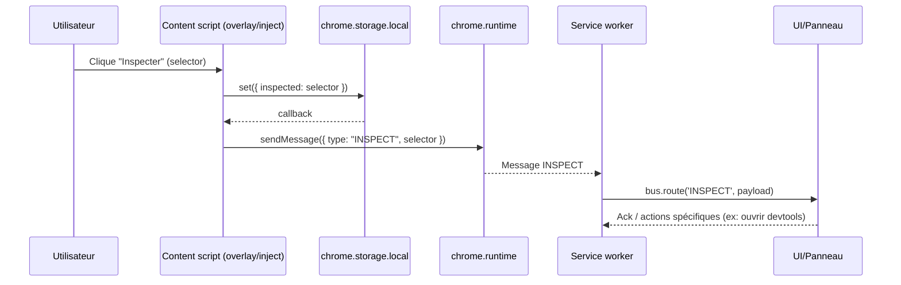
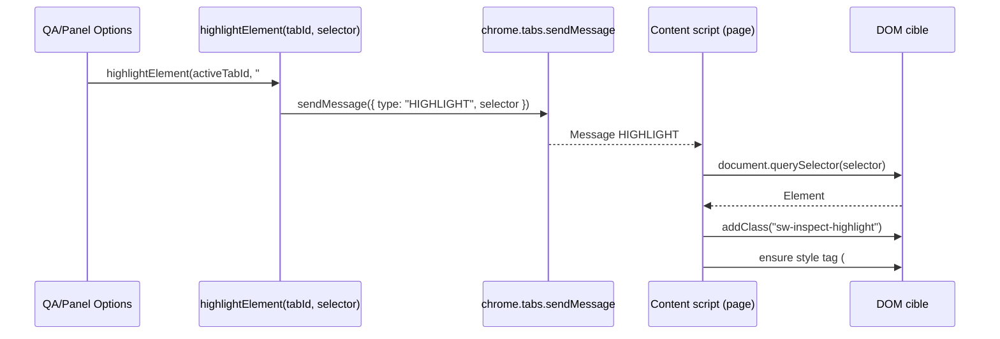

# Architecture et composants

SilentWeb est structuré comme un monorepo PNPM avec plusieurs paquets spécialisés. Cette vue d’ensemble vous aidera à naviguer entre les dossiers et à comprendre comment les modules communiquent.

## Vue d’ensemble
```
SilentWeb/
├─ packages/
│  ├─ core/         # Utils partagés (texte, audio, async, types)
│  └─ ui/           # Composants d’interface, build Vite
├─ src/
│  ├─ content/      # Scripts injectés (overlay, inspect, highlight)
│  ├─ worker/       # Service worker (cache, notifications)
│  ├─ messaging/    # Bus d’événements, abstractions runtime
│  └─ common/       # Options, stockage, thèmes, utilitaires
├─ public/          # Manifest et assets packagés
├─ tests/           # Vitest, Playwright, mocks Chrome
└─ tools/           # Scripts internes (copy, build, automation)
```

## Flux principaux
1. **Content scripts → Service Worker** : les scripts injectés envoient des messages (via `chrome.runtime.sendMessage`) vers le service worker pour accéder au stockage, aux permissions et aux APIs réseau.
2. **Bus de messagerie (`src/messaging/bus.ts`)** : unifie les événements (inspection, sous-titres, alertes) et simplifie les tests unitaires.
3. **Core package** : `packages/core/src` expose des fonctions pures (`normalizeText`, `makeTranscription`, `Emitter`, etc.) réutilisées par l’extension, les tests et les outils CLI.
4. **UI package** : `packages/ui` génère des bundles Vite destinés au panneau d’options et aux overlays dans la page.

## Séquences inspect/highlight
Les fonctions `inspectElement` / `highlightElement` exposées dans `src/utils/inspect.js` servent de contrat entre les outils de QA et les content scripts. Elles savent agir localement (DOM déjà présent) ou déléguer à un autre contexte via la messagerie WebExtensions.

### Inspecter un sélecteur
Quand l’utilisateur déclenche l’inspection depuis l’overlay ou le panneau d’options, la séquence suivante est exécutée :



- `src/content/inject.ts` et `src/utils/inspect.js` implémentent l’écriture dans `chrome.storage.local` suivie du `runtime.sendMessage`.
- Les tests `tests/unit/inject.spec.js` vérifient cet enchaînement afin d’éviter une régression de stockage ou de messaging.
- Le service worker (`packages/extension/src/worker/service.ts`) et les panneaux qui s’abonnent via `bus.route('INSPECT', ...)` peuvent ainsi réagir de façon déterministe : journaliser, précharger un overlay ou afficher la fiche de l’élément inspecté.

### Mettre un élément en surbrillance
La même fonction `highlightElement` sait soit travailler directement sur un `Element`, soit envoyer un message à un onglet distant. Le flux inter-onglets ressemble à ceci :



- Quand `highlightElement` reçoit un nombre en premier argument (`tabId`), il délègue à `chrome.tabs.sendMessage`. Sinon il agit localement sur l’`Element`.
- Le content script destinataire réutilise la même utilité (`highlightElement(element)`) ce qui garantit l’injection d’un `<style>` unique et la même classe CSS (`.sw-inspect-highlight`) partout.
- L’API `clearHighlight` supprime ensuite la classe pour éviter les fuites visuelles pendant les sessions QA.

## Builds
- **TypeScript** : `pnpm run build:ts` compile le code TS en CJS/ESM selon `tsconfig.json`.
- **Content scripts (JS)** : `pnpm run build:inject` / `build:overlay:js` utilisent `terser` pour minifier.
- **CSS** : `build:overlay:css` avec `cleancss`.
- **Service Worker** : `build:sw` minifie `worker/sw.js`.

## Tests
- **Vitest** (unit tests) : `vitest.config.ts` configure un environnement `jsdom`, des fichiers de setup et exclut `tests/e2e/**`.
- **Playwright** : `tests/e2e/` contient les suites, `tests/e2e/fixtures` fournit les pages HTML et VTT utilisées pour simuler des médias.
- **Mocks** : `tests/unit/chrome.mock.js` simule les APIs `chrome.runtime`, `chrome.tabs`, `chrome.storage`.

## Localisation
Les chaînes sont stockées dans `_locales/<lang>/messages.json`. Chaque clé correspond à un message UI. Pour ajouter une langue :
1. Copiez un fichier existant (ex. `_locales/en/messages.json`).
2. Traduisez les champs `message`.
3. Référencez la langue dans `public/manifest.json` si nécessaire.

## Sécurité & confidentialité
- Traitement audio/texte réalisé côté client.
- Pas de dépendance serveur obligatoire.
- Les privilèges d’extension se limitent aux permissions déclarées dans `manifest.json`.

Pour un diagramme détaillé, consultez également `docs/architecture.md` qui approfondit certains composants.

## Playbook de débogage (content scripts)
1. **Lancer l’extension avec rechargement**  
   `pnpm run dev` démarre `web-ext run` (voir `package.json`). Firefox Developer Edition ouvre l’extension et recharge automatiquement les scripts injectés. Gardez `about:debugging#/runtime/this-firefox` ouvert pour inspecter le service worker et les content scripts.

2. **Tracer les messages runtime**  
   Dans la console du service worker (ou de la page), collez :  
   ```js
   browser.runtime.onMessage.addListener((msg, sender) => {
     console.debug("[SilentWeb][debug]", sender.tab?.id, msg);
   });
   ```  
   Les flux `INSPECT`/`HIGHLIGHT` deviennent ainsi visibles avec l’identifiant d’onglet.

3. **Vérifier l’état stocké**  
   `chrome.storage.local.get(["inspected"], console.log)` confirme que `inspectElement` a bien persisté le dernier sélecteur (clé `inspected`, voir `src/common/constants.js`). Utilisez `clearInspected()` pour repartir d’un état propre.

4. **Forcer un highlight manuel**  
   Depuis la console du panneau d’options ou du background :  
   ```js
   const [tab] = await browser.tabs.query({ active: true, currentWindow: true });
   await browser.tabs.sendMessage(tab.id, { type: "HIGHLIGHT", selector: "#video" });
   ```  
   Vérifiez dans l’onglet ciblé que la classe `.sw-inspect-highlight` est ajoutée/supprimée comme prévu.

5. **Verrouiller avec les tests unitaires**  
   `pnpm vitest tests/unit/inspect.spec.js` rejoue les scénarios d’inspection/ surbrillance en simulant les APIs `chrome.*`. Ajoutez un test avant de pousser une modification complexe côté content script pour éviter les régressions silencieuses.
